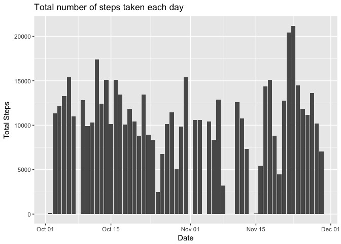
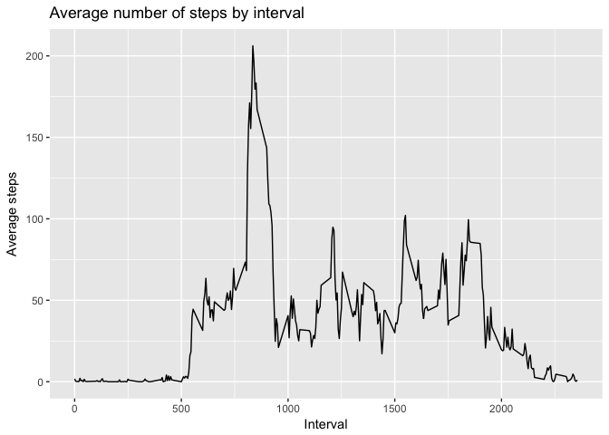
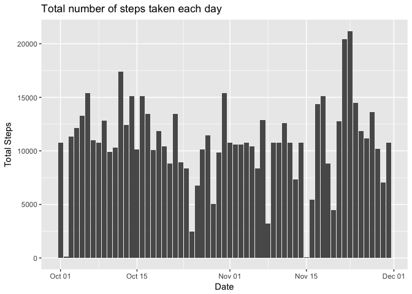
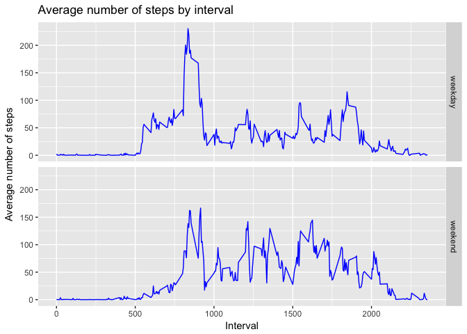

# Reproducible Research: Peer Assessment 1

## Libraries

```r
library(data.table)
library(dplyr)
library(ggplot2)
```

## Loading and preprocessing the data

```r
activity_df <- read.table("../data/activity.csv", header=TRUE, sep=",")
activity_df <- activity_df %>% 
    transform(date=as.Date(date,"%Y-%m-%d"))
activity_noNA_df <- filter(activity_df, !is.na(steps))
```

## What is mean total number of steps taken per day?

### 1. A histogram of the total number of steps taken each day

```r
total_steps_group <- group_by(activity_noNA_df, date)
total_steps_df <- summarise(total_steps_group, totalsteps = sum(steps))

ggplot(data=total_steps_df, aes(x=date, y=totalsteps)) +
    geom_bar(stat="identity", na.rm=TRUE) +
    labs(x="Date", y="Total Steps", title="Total number of steps taken each day")
```

<!-- -->

### 2. The *mean* and *median* total number of steps taken per day

```r
mean(total_steps_df$totalsteps)
```

```
## [1] 10766.19
```


```r
median(total_steps_df$totalsteps)
```

```
## [1] 10765
```

## What is the average daily activity pattern?
### 1. A time series plot of the 5-minute interval and the average number of steps taken, averaged across all days


```r
interval_steps_group <- group_by(activity_noNA_df, interval)
interval_steps_df <- summarise(interval_steps_group, avgsteps = mean(steps))

ggplot(data=interval_steps_df, aes(x=interval, y=avgsteps)) +
    geom_line() +
    labs(x="Interval", y="Average steps", title="Average number of steps by interval")
```

<!-- -->

### 2. Which 5-minute interval, on average across all the days in the dataset, contains the maximum number of steps?

```r
interval_steps_df[which.max(interval_steps_df$avgsteps),]$interval
```

```
## [1] 835
```

## Imputing missing values
### 1. Calcuate and report the total number of missing values in the dataset.

```r
sum(is.na(activity_df))
```

```
## [1] 2304
```

### 2. Fill in all the missing values in the dataset.

```r
# fill in the missing data using the average steps for that interval

# interval_steps_df
a2_df <- merge(activity_df, interval_steps_df, by="interval")
a2_df[is.na(a2_df$steps),]$steps <- a2_df[is.na(a2_df$steps),]$avgsteps
```

### 3. Create a new dataset with the missing data filled in.

```r
activity_filled_df <- a2_df[c("steps", "date", "interval")]
```

### 4. Make a histogram of the total number of steps taken each day and calcuate and report the *mean* and *median* total number of steps taken per day. Do these values differ from the estimates from the first part of the assignment? What is the impact of imputing missing data on the estimates of the total daily number of steps?

```r
total_steps_group_filled <- group_by(activity_filled_df, date)
total_steps_filled_df <- summarise(total_steps_group_filled, totalsteps = sum(steps))

ggplot(data=total_steps_filled_df, aes(x=date, y=totalsteps)) +
    geom_bar(stat="identity") +
    labs(x="Date", y="Total Steps", title="Total number of steps taken each day")
```

<!-- -->

```r
mean(total_steps_filled_df$totalsteps)
```

```
## [1] 10766.19
```

```r
median(total_steps_filled_df$totalsteps)
```

```
## [1] 10766.19
```
**What is the impact of imputing missing data on the estimates of the total daily number of steps?** The impact to the mean and median are low.

## Are there differences in activity patterns between weekdays and weekends?
### 1. Create a new factor variable in the dataset with two levels -- "weekday" and "weekend" indicating whether a given date is a weekday or weekend day.

```r
weekcategory <- function(date) {
    
    dayofweek <- weekdays(as.Date(date))
    
    if(dayofweek %in% c("Saturday", "Sunday")) {
        "weekend"
    }
    else {
        "weekday"
    }
}

activity_week_cat <- sapply(activity_filled_df$date, weekcategory)
activity_filled_df$weekcategory <- as.factor(activity_week_cat)
```

### 2. Make a panel plot containing a time series plot of the 5-minute interval (x-axis) and the average number of steps taken, averaged across all weekday days or weekend days (y-axis). 

```r
interval_steps_week_cat_group <- group_by(activity_filled_df, interval, weekcategory)
interval_steps_week_cat_df <- summarise(interval_steps_week_cat_group, avgsteps = mean(steps))

ggplot(data=interval_steps_week_cat_df, aes(x=interval, y=avgsteps)) +
    facet_grid(weekcategory ~ .) + 
    geom_line(color="blue") +
    labs(x="Interval", 
         y="Average number of steps", 
         title="Average number of steps by interval")
```

<!-- -->
